# captchacker2
一个基于SVM的验证码破解程序

##起因
弄这个项目的原因，是目前还没有发现一个比较好用的验证码识别模块，目前的验证码识别主要是基于google的光学字符识别Tesseract-OCR如[PyOCR](https://github.com/jflesch/pyocr),识别精度有限，对于一些复杂的验证码无法识别

##目前主要工作
这个项目改造自https://code.google.com/p/captchacker/，原项目已停止更新

##接下来的工作

1. 整理代码，使能够模块化，提供一个通用接口
2. 使用Python替换的原来C++，重写验证码分割及字符居中模块，做跨平台处理
3. 增加利用anti-captcha的人眼识别功能来提供训练数据

如果有其他疑问，请与我联系 tangxuguo#gmail.com,欢迎提交代码

##环境搭建
运行环境（以下在ubuntu12.04 64位机器下测试）
		
安装libsvm

	sudo apt-get install python-libsvm
安装opencv

	sudo apt-get install libopencv-dev python-opencv

生成验证码pycaptcha

仿真这块用到了pycaptcha，这个是用来生成验证码的，这个模块已经停止更新，我下了一个版本，在python2.7上目前可用，请自行安装

	svn co http://svn.navi.cx/misc/trunk/pycaptcha/
	cd pycaptcha
	python setup.py install

然后把captchacker目录下的Fonts里的字体，拷到如下路径里面，否则pycaptcha无法识别,这个包需要依赖PIL

	sudo cp -r Fonts /usr/local/lib/python2.7/dist-packages/Captcha/data/fonts/

##程序说明：
	
###使用方式

  

##将用到的算法

+ de_noise去噪
+ color_filter颜色过滤
+ edge_detection边缘检测
+ floodfill油漆桶
+ dynamic_programing动态规划
+ Erosion腐蚀
+ Dilation膨胀
+ Pixels_projection像素投影(垂直和斜切)
+ svm支持向量机
+ 干扰线检测（深度优先搜索和最短路径算法）

对于一些和文字颜色相同但是较为分散和单一的干扰像素点，我们可以用判断相邻像素的方法，对于每个点判断该点和相邻8个点的色差，若色差大于某个值，则+1，如果周围有超过6个点的色差都比较大，说明这个点是噪点。对于图像边界的一圈像素，周围没有8个像素，则统统清除，反正文字都在图片的中间位置。

对于1个像素粗细的干扰线，在字符为2个像素以上的时候，可以用去噪点算法作为滤镜，多执行几次，就可以完美的把细干扰线去掉。

种子填充算法可以方便的计算出任意色块的面积，对于没有粘连字符或者粘连但是字符每个颜色不一样的验证码来说，去除干扰色块的效果很好，你只需要大概计算一下最小的和最大的字符平均占多少像素，然后把这段区间之外像素数的色块排除掉即可。

###模型训练流程

两种方式，采用自己的fonts训练，或者是采用原始网站验证码训练

###算法识别流程

原始图片-》 彩色去噪（颜色过滤，去除背景）-》干扰线检测-》二值转换-》黑白去噪（统计邻域像素，统计轮廓像素）-》切割（种子填充，像素投影，动态规划，固定宽度扫描）-》标准化字符矫正-》SVM

##部分案例
难易程度   | 来源  | 例图 | 识别率 | 详细
----- | ----- | ------ | ----- | -----
★★☆☆☆ | [Egoshare] | <a href="http://www.egoshare.com/captcha.php">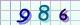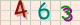 </a>| 100% | 3位数字
★★★★☆  | [baidu] | <a href="https://passport.baidu.com/cgi-bin/genimage?tcIcaptchaservice386535315269792b4177776c4e726f54354a7a4e387332396f4c4d4b446c437137436736656874415a422f64687642356f4134347150466551592b4961384b79496d35442f6d514157763645507332705a61545950736e5735556935342f50365879466d7830535a622f77522f6f3973775365304d454b6979744d3637766a755134504c5047762f396b304d4856417535534d424e3159716d6f366a2b6f73486a6d69566e31766d796b4d6e574453384663464131396438496c67566c317a65684a68614566616f4653364c4a465a576e4a6c362b657776444f73764a7a54316a4270744730426e7a4341756c2b57385a66705655486e484e5373514a6a72703170303130742f3376514b456866536b62665162465464562f3843566e38634866795577565775416753485a"> </a>| 50% | 4位数字加字母
★★★★☆  | [sina] | <a href="https://mail.sina.com.cn/cgi-bin/imgcode.php?t=1435471782589">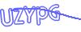 </a>| 50% |数字加字母
★★★★☆  | [sohu] | | 50% |数字加字母
★★★★☆  | [QQ] | | 50% |数字加字母
★★★★☆  | [zhihu] | <a href="http://www.zhihu.com/captcha.gif?r=1435474138937">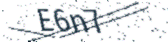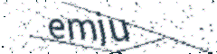 </a>| 50% |数字加字母
★★★★☆  | [jaccout] | <a href="https://jaccount.sjtu.edu.cn/jaccount/captcha">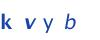 </a>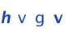 </a>| 50% |4-5字母
★★★★☆  | [hotmail] | 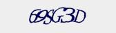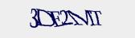 | 10% | 

###暂未识别，需要训练，在研究

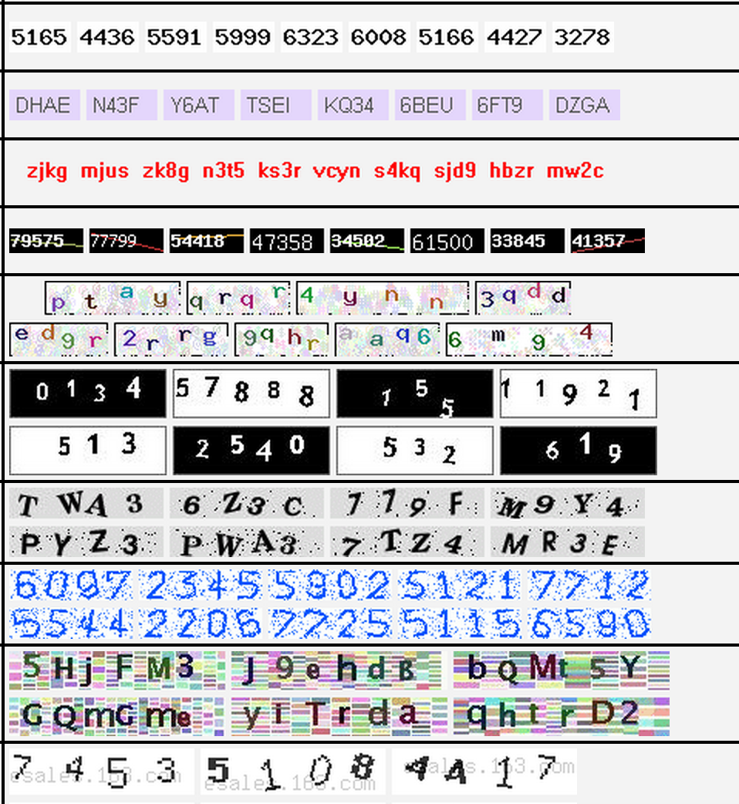
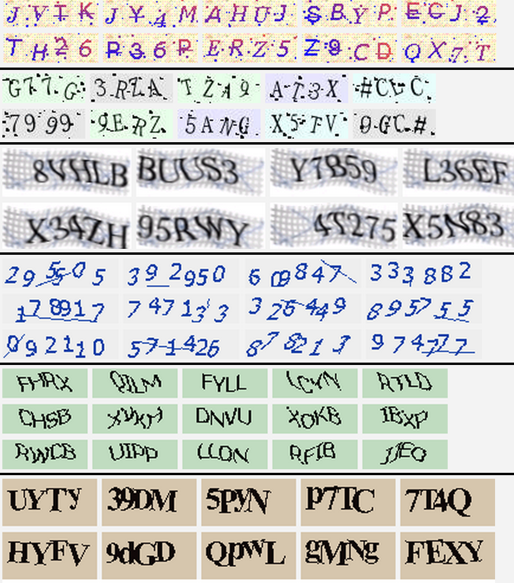
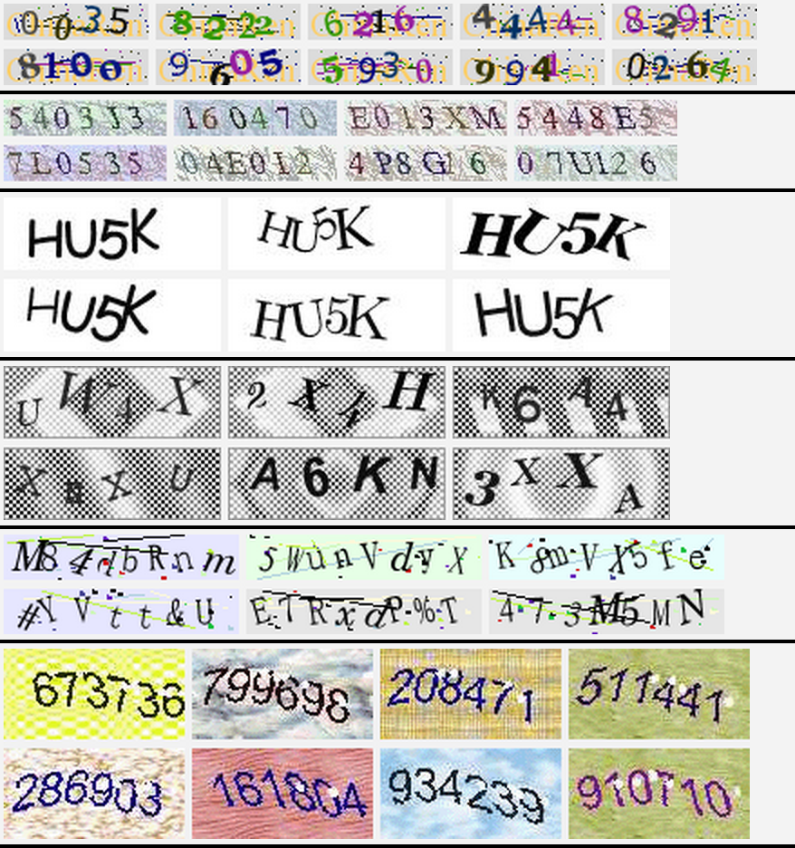
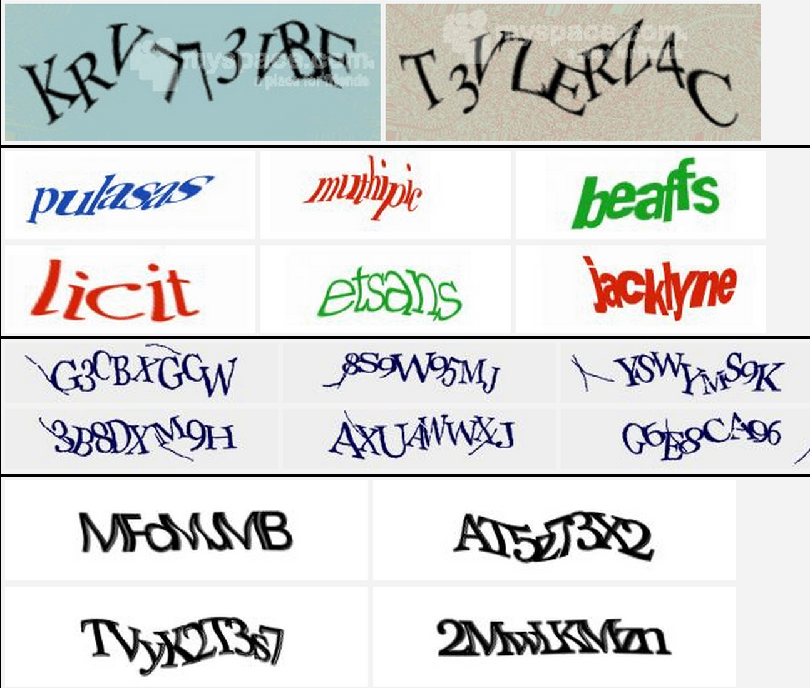

欢迎提交新的验证码类型

本项目仅供学术研究，请勿用于其他用途，使用本程序造成的后果请自负

